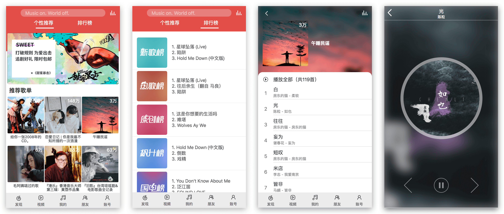

🎶 基于 React 实现的仿 iOS 客户端网易云音乐。

在线地址：**[戳我](http://118.24.21.99:5001/)**（PC 浏览器需切换到移动端模式）

移动端体验：

## 预览

## 技术栈

- React 16.3
- TypeScript
- Mobx + Redux
- react-redux
- react-router-v4
- Scss

## 实现细节

目前只实现了上面四个页面，但是总体的结构已经形成了，其他页面的添加只是时间上的问题 ~~（其实是懒）~~，暂时没有实现，下面是目前已实现的功能的细节：

### 局部状态管理

像首页的 banner 或者推荐歌单等，都是不会被共享的局部状态，使用 Mobx 来进行请求的发起和状态的管理。

### 全局状态

播放器的状态是一个全局状态，包括当前的播放列表，切歌，播放 / 暂停等，所以很自然的使用 redux 来进行管理，可以清楚的掌握所有改变全局状态的行为。

### TypeScript

尽管上手需要掌握一些语法，但是静态类型与自动提示都能提供很大的帮助，在这个并不大的项目中我也体验到了很大的帮助。但是要注意的是 TS 其实并不严格限制对象的类型，只要够懒，遍地 any，就会把 TS 写成 JS，所以为了充分发挥 TS 的威力，一定要有良好的 TS 代码风格。

### 手势滑动

为了模仿 iOS 端可以通过滑屏切换页面的功能，通过监听 `touchStart`，`touchMove`，`touchEnd` 来进行手势的判断并通过 `transform` 触发模拟滚动实现，在  `touchMove` 中检测监听滑动的方向及距离，在 `touchEnd` 中触发路由的切换及页面吸附到整屏的位置。

### 歌单的状态保留

有这么一个操作需要注意：用户在某歌单往下滑了几下，然后点了某歌播放然后进入了播放器，会发生路由的改变，如果此时从播放器返回，会丢包包括滚动位置在内的歌单页的所有状态丢失（因为 re-mount 了）。

我造了一个轮子来解决这个问题：[react-live-route](https://github.com/fi3ework/react-live-route)，是对 react-router-v4 中 Route 组件的增强，简单的说就是将歌单页隐藏掉而不是 unmount 掉，具体的解决思路可以参考轮子里的文档。

## API

项目中用到的网易云音乐的 API 来自 [NeteaseCloudMusicApi](https://binaryify.github.io/NeteaseCloudMusicApi/#/?id=neteasecloudmusicapi)。

## TODO

目前还有一些部分没完成，包括但不限于：

- [ ] code splitting
- [ ] 组件中有些功能还是有耦合，需要再抽象
- [ ] SSR

## 开发

克隆代码到本地之后，需要在 4000 端口运行 [NeteaseCloudMusicApi](https://binaryify.github.io/NeteaseCloudMusicApi/#/?id=neteasecloudmusicapi)。